# Helpdesk Corporativo

Sistema interno de abertura e gestão de chamados para rede local bancária, com
triagem automática por IA (plug and play), hierarquia de papéis, SLA em horário
comercial, trilha de auditoria e interface com tema claro/escuro.

## Stack

| Camada        | Tecnologia                                    |
|---------------|-----------------------------------------------|
| Front-end     | HTML + CSS + JavaScript puro (Vanilla JS)     |
| Gráficos      | Chart.js                                      |
| Back-end      | Python + FastAPI (API REST)                   |
| ORM / Banco   | SQLAlchemy + SQLite (WAL)                      |
| Autenticação  | JWT (com versão/revogação) + bcrypt           |

## Estrutura do projeto

```
helpdesk/
├── backend/
│   ├── main.py             # Entrypoint (uvicorn main:app): monta a app e os routers
│   ├── seed.py             # CLI de dados de exemplo (python seed.py [--reset])
│   ├── requirements.txt
│   ├── alembic.ini
│   ├── alembic/            # Migrações de schema (batch mode p/ SQLite)
│   └── app/                # >>> Pacote da aplicação <<<
│       ├── config.py       # Configurações: segredos, SLA, rate limit, uploads
│       ├── database.py     # Engine/sessão SQLAlchemy + PRAGMAs do SQLite (WAL)
│       ├── models.py       # Tabelas e enums (Usuario, Chamado, Comentario, ...)
│       ├── schemas.py      # Validação e sanitização (Pydantic)
│       ├── security/       # Autenticação e defesa
│       │   ├── auth.py     # Hash, JWT, papéis, escopo hierárquico, política de senha
│       │   └── rate_limit.py  # Rate-limit / anti-brute-force PERSISTENTE (tabela)
│       ├── services/       # Regras de negócio / domínio
│       │   ├── ia.py       # >>> MÓDULO DE IA (mock plug and play) + PII mask <<<
│       │   ├── sla.py      # SLA em horário comercial + aging
│       │   ├── escalonamento.py # Job em background: escala SLA vencido
│       │   ├── estado.py   # Máquina de estados do chamado
│       │   ├── busca.py    # Busca textual FTS5 (similares + KB + deflexão)
│       │   ├── notificacoes.py  # Camada de notificação plugável (log/Teams/Slack)
│       │   ├── auditoria.py     # Helper da trilha de auditoria
│       │   ├── protocolo.py     # Protocolo (contador atômico, sem corrida)
│       │   └── serializar.py    # ORM -> schemas de resposta (campos derivados)
│       └── routers/        # Rotas da API (um arquivo por área)
│           ├── auth.py     # /api/auth/*      (login, auto-cadastro, troca de senha)
│           ├── chamados.py # /api/chamados/*  (abrir, deflexão, equipe, cancelar, anexos)
│           ├── admin.py    # /api/admin/*     (gestão, dashboard, export, ação em massa)
│           ├── usuarios.py # /api/admin/usuarios/* (gestão de usuários/hierarquia)
│           └── kb.py       # /api/kb/*        (base de conhecimento)
└── frontend/
    ├── templates/
    │   ├── index.html      # Login + solicitação de cadastro
    │   └── app.html        # Aplicação logada
    └── static/
        ├── css/estilo.css  # Tokens de tema (#800000) + tema claro/escuro
        └── js/
            ├── tema.js     # Gerencia tema claro/escuro (persistente)
            ├── api.js      # Camada de comunicação com a API
            ├── login.js    # Login e auto-cadastro
            └── app.js      # Controlador principal (tabelas, modais, gráficos)
```

## Como executar

```bash
cd backend

# 1. Instalar dependências (idealmente em um virtualenv)
pip install -r requirements.txt

# 2. Definir a chave secreta (OBRIGATÓRIO em produção)
export HELPDESK_SECRET_KEY="uma-chave-longa-e-aleatoria-aqui"

# 3. Popular o banco com dados de exemplo
python seed.py            # cria o que faltar
python seed.py --reset    # APAGA e recria o schema (use ao evoluir o modelo)

# 4. Subir o servidor
uvicorn main:app --host 0.0.0.0 --port 8000
```

Acesse: **http://localhost:8000** · Documentação da API: **http://localhost:8000/docs**

> **Schema e migrações:** em **desenvolvimento**, `python seed.py --reset` recria
> tudo do zero (rápido). Para **migrações versionadas** há **Alembic** configurado
> (com `render_as_batch=True` por causa do `ALTER TABLE` limitado do SQLite):
> ```bash
> alembic upgrade head                              # aplica as migrações
> alembic revision --autogenerate -m "minha mudanca"  # gera nova migração
> ```

## Credenciais de teste (geradas pelo seed)

| Papel         | Matrícula      | Senha        |
|---------------|----------------|--------------|
| Administrador | `admin`        | `Admin@1234` |
| Coordenador   | `carla.coord`  | `Senha@1234` |
| Líder         | `lucas.lider`  | `Senha@1234` |
| Analista      | `ana.analista` | `Senha@1234` |
| Colaborador   | `joao.silva`   | `Senha@1234` |
| Colaborador   | `maria.souza`  | `Senha@1234` |

> Em produção, integre a autenticação com o Active Directory / LDAP do banco
> e force troca de senha no primeiro acesso.

## Papéis e escopo de visão (hierarquia)

Cada usuário tem um **papel** e, opcionalmente, um **supervisor** (auto-relação),
formando uma árvore. O acesso se divide em dois grupos:

| Quem | Vê / controla |
|------|----------------|
| **Administrador** | tudo — painel, todos os chamados, usuários e auditoria |
| **Qualquer outro papel** (colaborador, analista, líder, coordenador) | os **próprios** chamados **+ os de toda a cadeia abaixo** dele na árvore (subordinados diretos e indiretos) |

- Quem tem subordinados ganha a aba **"Minha equipe"** (lista a cadeia abaixo com
  contadores de chamados) e um **filtro por solicitante** em "Meus chamados".
- **Cancelamento**: o **dono** pode cancelar o próprio chamado e **qualquer
  superior** na cadeia pode cancelar o de quem está abaixo — sempre com
  **justificativa obrigatória** (vira comentário público + registro de auditoria).
  Não cancela o que já está resolvido/fechado.
- O *papel* (analista, líder, coordenador) serve à exibição e para o admin
  atribuir responsáveis. O **atendimento** da fila (responder, classificar,
  resolver) é **exclusivo do administrador** — os demais apenas veem e cancelam.

Trocar papel, desativar usuário ou redefinir senha **revoga as sessões abertas
imediatamente** (via `token_version` no JWT).

## Funcionalidades

**Usuário (qualquer papel não-admin)**
- **Abrir chamado** com campos ricos (categoria/subcategoria, sistema, módulo/tela,
  impacto, urgência, unidade, contato), **descrição mínima** (gate de qualidade) e
  **anexos** (prints, PDF, logs) — triagem de IA automática na criação.
- **Autoatendimento / deflexão**: ao digitar título e descrição, o sistema sugere
  **artigos da KB e chamados já resolvidos parecidos** ("Isso já não resolve?")
  antes de abrir — reduz volume de chamados.
- **Meus chamados**: os próprios **+ os de toda a equipe abaixo**, com **filtro por
  solicitante**; timeline de comentários (sem ver notas internas), **baixar anexos**,
  **comentar** e **avaliar (CSAT)** os próprios, **cancelar** (o próprio ou o de um
  subordinado, com justificativa) e **reabrir** um chamado encerrado.
- **Base de conhecimento**: página própria para **buscar artigos** e se autoatender.
- **Como usar**: manual integrado, com a seção do **seu perfil destacada** e o guia
  completo de todos os perfis (conceitos, status, SLA, hierarquia e FAQ).
- **Minha equipe**: as pessoas abaixo na hierarquia, com contadores; clicar leva
  aos chamados daquela pessoa.
- **Auto-cadastro** pela tela de login: a conta fica **pendente** até a aprovação
  de um administrador.
- **Troca de senha obrigatória no 1º acesso** quando a conta foi criada pelo admin
  (senha provisória).

**Administrador**
- **Painel**: KPIs (abertos, resolvidos, críticos, tempo médio, SLA vencido/risco,
  **CSAT** e **% de SLA cumprido**) e gráficos de gravidade, status, prioridade,
  **aging**, **SLA**, **workload** e **CSAT por analista/categoria** — com botão
  **Imprimir / PDF**.
- **Gestão de chamados** (atende TODOS): fila **paginada**, filtrável por status,
  gravidade, **categoria**, **período (datas)**, **SLA** e busca, com **exportação
  CSV** e **ações em massa** (atribuir/mudar status/cancelar vários de uma vez);
  modal em abas com triagem da IA, **correção da classificação**, atribuição,
  transição de status, resposta pública, **nota interna**, anexos, **encerramento**
  e **Conhecimento** (chamados similares, busca na KB e "promover a artigo").
- **Kanban operacional**: arraste os cartões entre colunas para mudar o status
  (validado pela máquina de estados); clique abre o chamado.
- **Base de conhecimento**: criar, **editar** e excluir artigos.
- **Gestão de usuários**: criar/editar, ativar/desativar, **aprovar** cadastros
  pendentes, definir papel/supervisor e **redefinir a senha de qualquer usuário**
  (que passa a ser provisória → troca no próximo acesso).
- **Trilha de auditoria**: quem fez o quê, quando e de onde.
- **Reset do banco**: botão protegido por re-confirmação de matrícula + senha.

## Capturas de tela

> Imagens em `docs/telas/` (tema claro, salvo indicação). Podem ser regeradas
> com o servidor no ar via `python backend/_screenshots.py`.

### Login
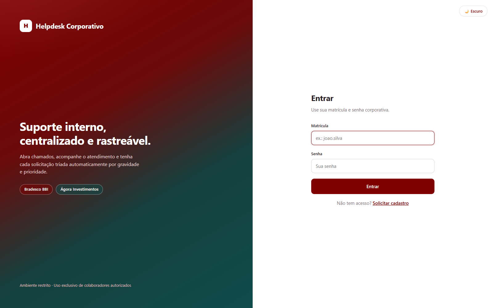

### Painel de indicadores (admin)
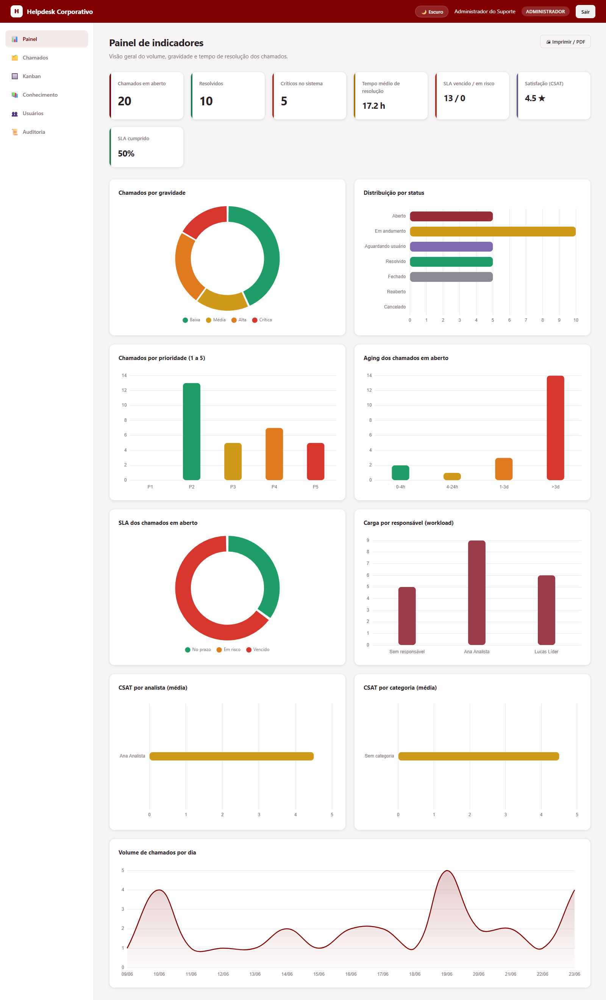

### Gestão de chamados (admin)
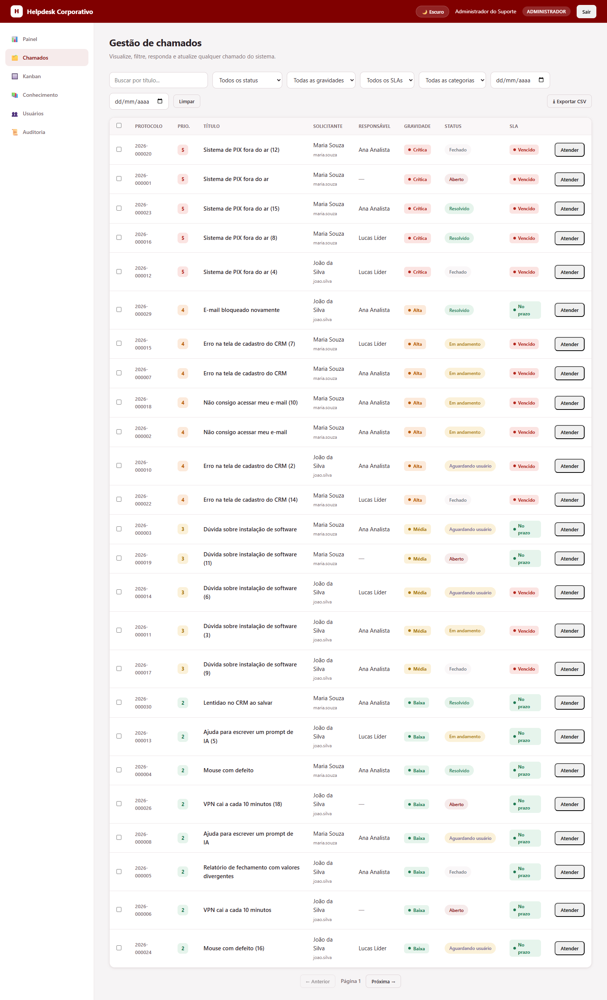

### Kanban operacional (admin)
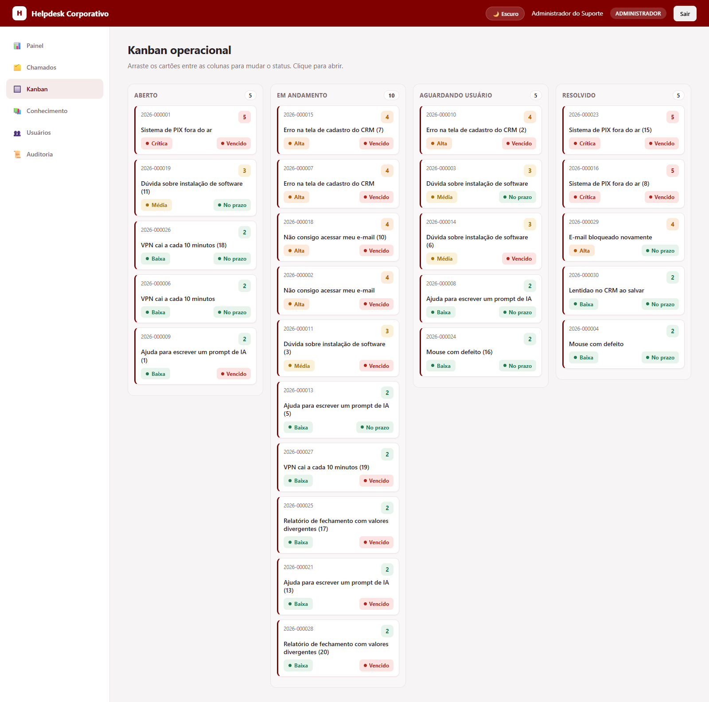

### Gestão de usuários (admin)
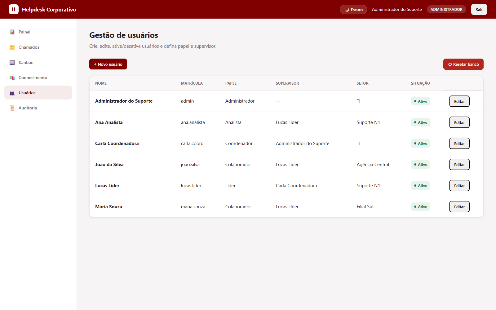

### Trilha de auditoria (admin)
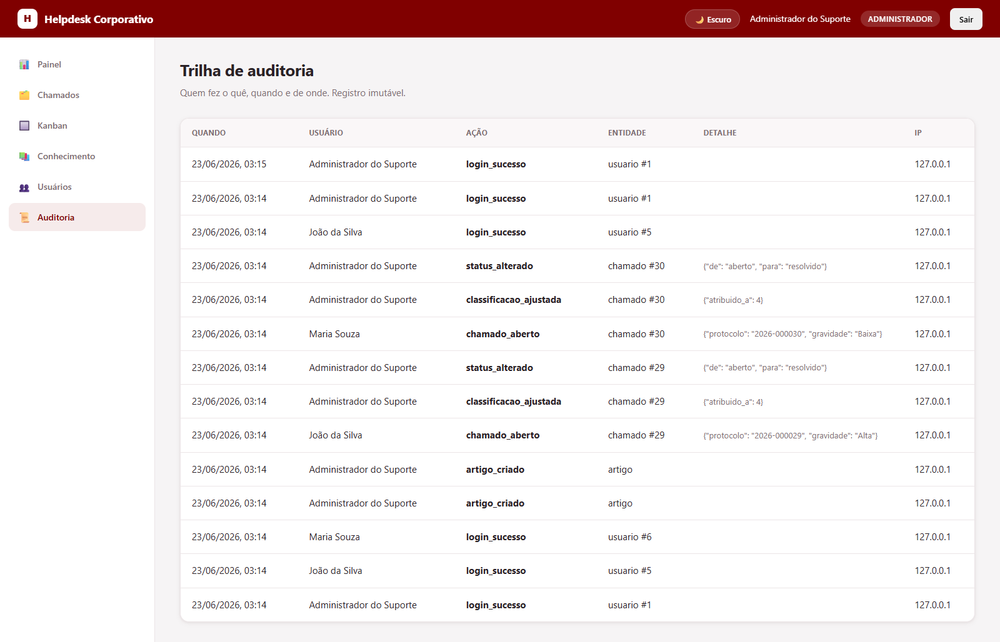

### Abrir chamado + deflexão (usuário)
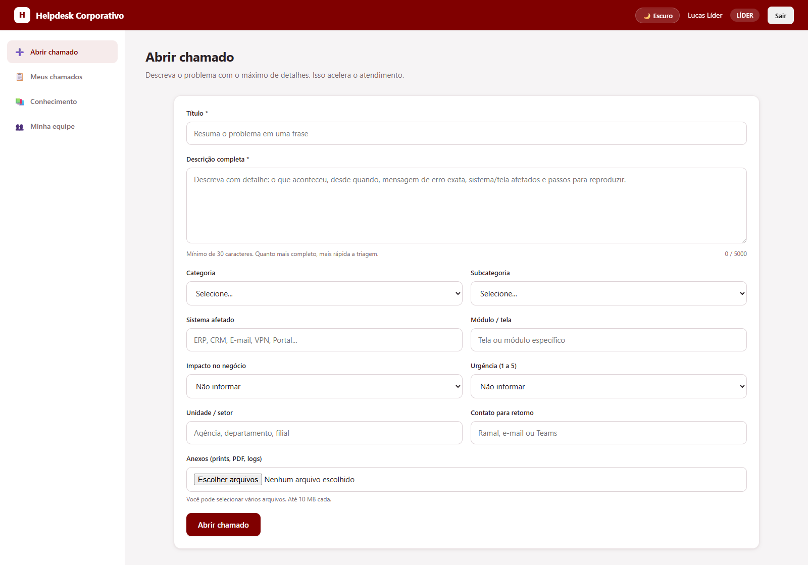

### Autoatendimento / deflexão (sugestões antes de abrir)
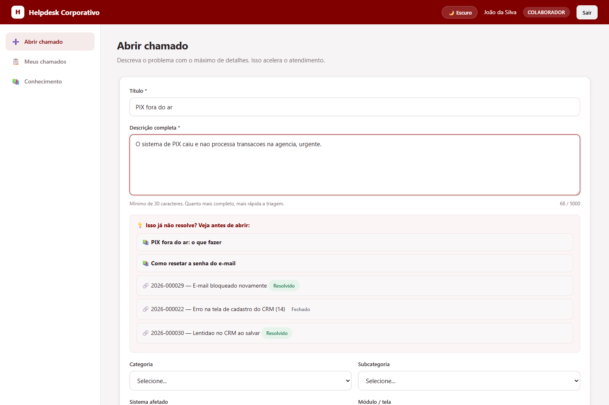

### Base de conhecimento
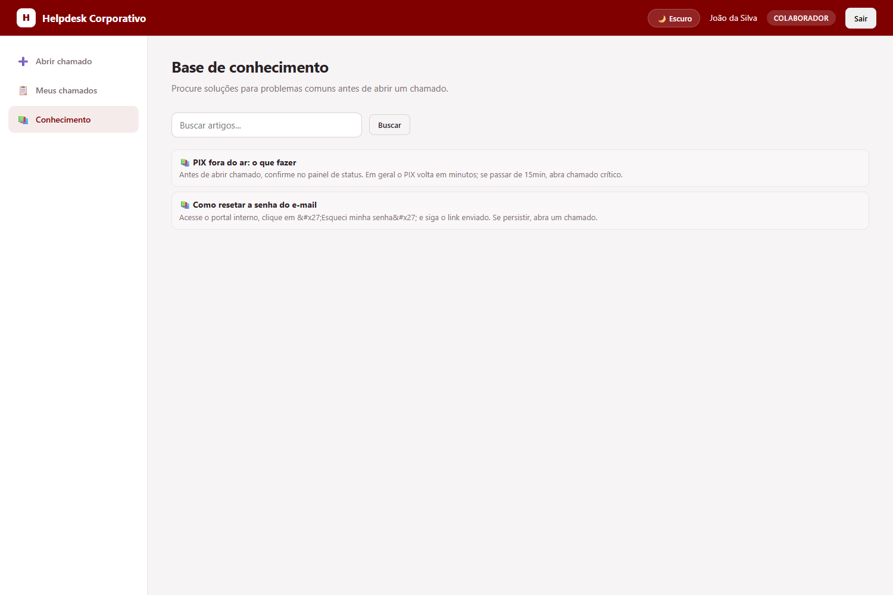

### Como usar (manual integrado)
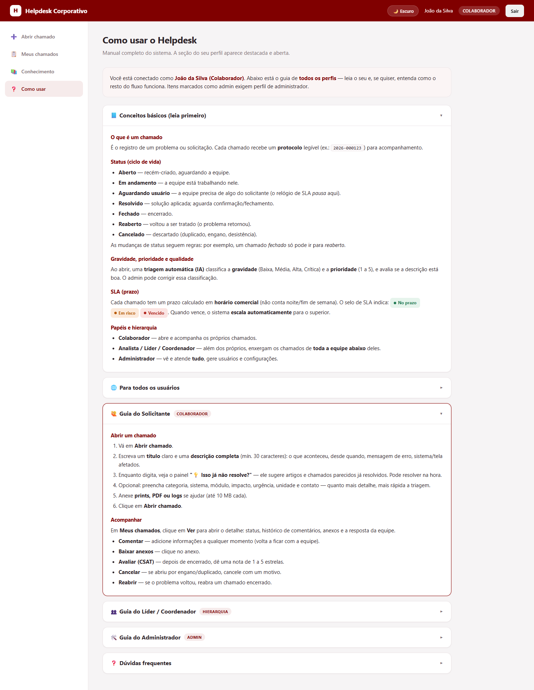

### Ação em massa (gestão)
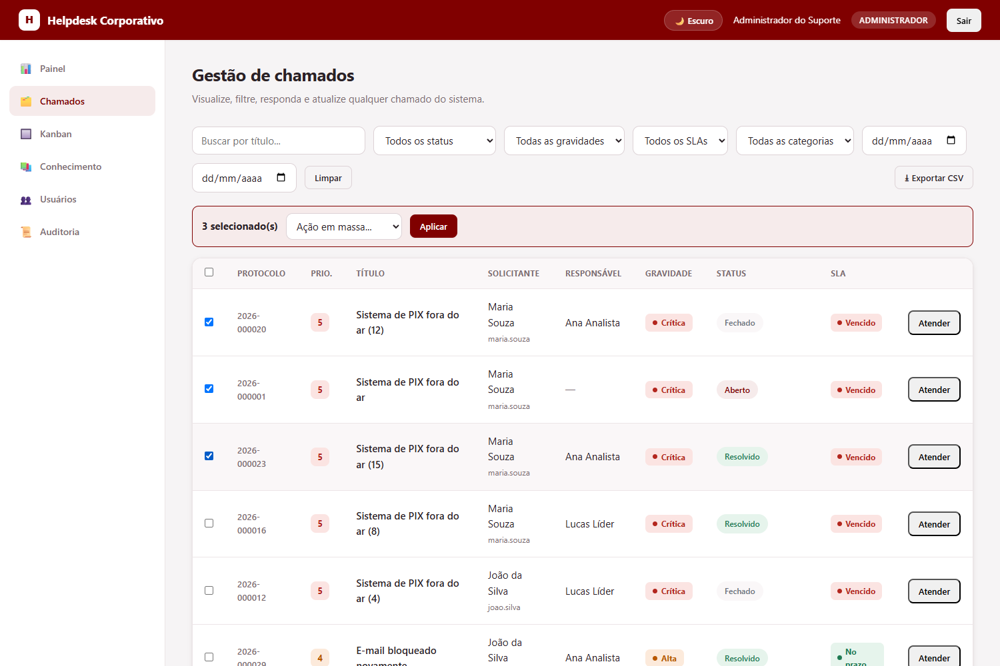

### Meus chamados — próprios + equipe (usuário)
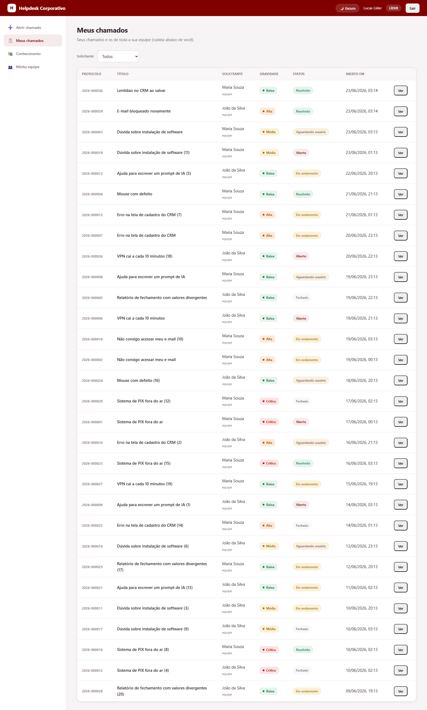

### Minha equipe (usuário com subordinados)
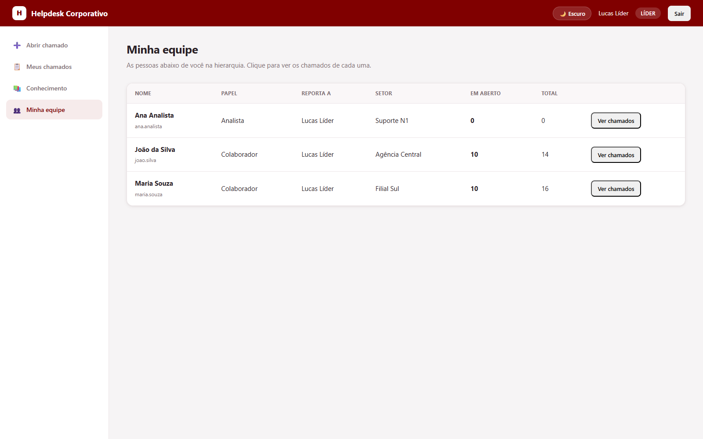

### Tema escuro
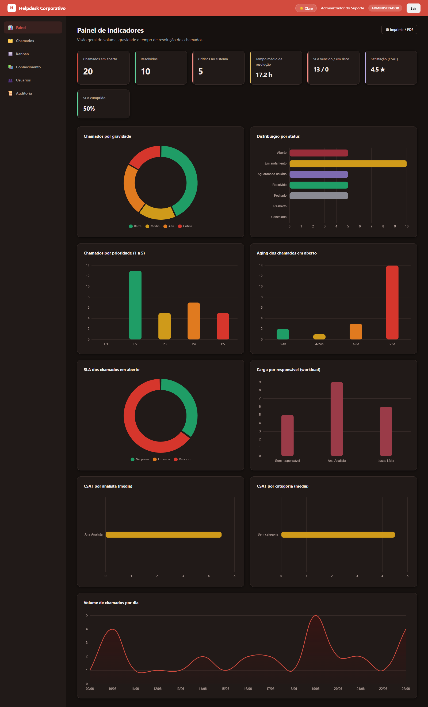

## A integração de IA (Plug and Play)

Toda a lógica de análise está isolada em **`app/services/ia.py`**. Hoje roda um
**mock** (`AnalisadorMock`) por heurísticas de texto. Contrato de saída estável:

```json
{
  "gravidade": "Baixa | Média | Alta | Crítica",
  "prioridade": 1,
  "qualidade_descritiva": "boa | ruim",
  "categoria_sugerida": "Acesso | Hardware | ... | null",
  "confianca": 0.9,
  "justificativa": "texto explicando a classificação",
  "versao_modelo": "mock-2.0.0"
}
```

Antes de qualquer texto chegar ao analisador, ele passa por `mascarar_pii()`,
que neutraliza **CPF, cartão, e-mail e telefone** (LGPD) — essencial quando a IA
for um serviço externo.

### Para plugar a IA real

1. Crie uma classe que herde de `AnalisadorIA` e implemente `analisar()`.
2. Troque **uma única linha** em `app/services/ia.py`:

```python
# Antes:
analisador_ativo: AnalisadorIA = AnalisadorMock()
# Depois:
from ia_proprietaria import AnalisadorBancoXPTO
analisador_ativo: AnalisadorIA = AnalisadorBancoXPTO(endpoint="...", token="...")
```

O resto do sistema não muda. Se a IA real cair, o chamado é criado mesmo assim,
marcado como `versao_modelo="indisponivel"` e `confianca=0.0` — sinal explícito
de que requer **triagem humana** (em vez de fingir uma classificação).

> **Análises avançadas (futuras):** já existem **pontos de conexão comentados**
> para a IA fazer análises extras — sugestão de resposta (copiloto), classificação
> de sentimento, detecção de duplicados, resumo para handoff e previsão de risco
> de SLA. Veja os blocos comentados em `app/services/ia.py` e `app/services/escalonamento.py`.

## Concorrência e robustez (SQLite)

- **WAL mode** + `busy_timeout`: leituras não bloqueiam escritas; aberturas
  concorrentes esperam o lock em vez de falhar (ver `app/database.py`).
- **Protocolo sem corrida**: `app/services/protocolo.py` usa uma linha-contador incrementada
  por `UPDATE` atômico — testado com 40 aberturas simultâneas, 0 duplicados.
- **Optimistic locking**: `versao_linha` no chamado evita sobrescrita simultânea
  (responde **409** se o registro mudou desde que foi carregado).
- **Rate limit / anti-brute-force PERSISTENTE** (`app/security/rate_limit.py`): a contagem de
  tentativas de login e de aberturas de chamado fica em **tabela** (não em memória
  de processo), então vale mesmo com `uvicorn --workers N`.
- **Notificações assíncronas** desacopladas via `app/services/notificacoes.py` (canal de log
  hoje, pronto para Teams/Slack por webhook).

## SLA (horário comercial) e escalonamento automático

O prazo de SLA é calculado em **horas úteis** (jornada e dias úteis
configuráveis em `app/config.py`), não em horas corridas. O relógio **pausa** quando
o chamado está em "aguardando usuário". Cada chamado expõe `sla_status`: `ok`,
`em_risco` ou `vencido`.

Um **job em background** (`app/services/escalonamento.py`) varre periodicamente os chamados em
aberto com SLA **vencido** e ainda não escalados, e: marca-os, **notifica o
superior** do responsável (ou a gestão) e registra na auditoria. Intervalo em
`HELPDESK_ESCALONAMENTO_INTERVALO` (0 desativa).

## Busca textual (FTS5) e base de conhecimento

`app/services/busca.py` mantém índices **FTS5** nativos do SQLite (sincronizados por gatilhos),
sem dependências externas nem embeddings:
- **Deflexão na abertura**: enquanto o usuário digita, sugere artigos da KB e
  chamados já resolvidos parecidos — para resolver antes de abrir.
- **Chamados similares**: na aba *Conhecimento* do atendimento, sugere chamados
  parecidos (apoio à deduplicação e ao reuso de solução).
- **Base de conhecimento**: página dedicada (leitura para todos); o admin pode
  **promover um chamado a artigo**, **criar/editar/excluir** e todos **buscam**
  por relevância (bm25).

## Segurança (considerações para ambiente bancário)

- **Senhas** com hash bcrypt — nunca em texto puro. **Política de complexidade**
  (maiúscula, minúscula, número e símbolo) e **troca obrigatória no 1º acesso**
  para contas criadas pelo admin (senha provisória).
- **JWT** com expiração curta e **revogação imediata** por `token_version`.
  Token em `sessionStorage` (expira ao fechar o navegador).
- **Sanitização de entrada** (Pydantic + escape de HTML) e **escape na
  renderização** — defesa em profundidade contra XSS.
- **Mascaramento de PII** antes da IA (CPF, cartão, e-mail, telefone).
- **SQL Injection** mitigado pelo SQLAlchemy (parâmetros vinculados).
- **Autorização por papel** e escopo hierárquico de visão.
- **Auto-cadastro** sempre cria colaborador inativo (aprovação obrigatória).
- **Ações destrutivas** (reset do banco) exigem re-confirmação de credenciais e
  ficam registradas na **trilha de auditoria**.
- **Uploads** validados por extensão e tamanho; binário em disco, metadados no
  banco (nome, tipo, tamanho, hash SHA-256).
- **Mensagens de erro genéricas** no login (não revelam se a matrícula existe).
- **Cabeçalhos de segurança** (CSP, X-Frame-Options, X-Content-Type-Options) e
  erros internos sem vazar stacktrace.

## Tema (claro / escuro)

A interface usa tokens CSS com a cor primária **`#800000` (marrom-vinho)** e
suporta **tema claro e escuro** via `data-theme`, com contraste AA. O toggle fica
no topo e a escolha persiste em `localStorage` (respeita a preferência do sistema
na primeira visita).

## Variáveis de ambiente úteis

| Variável                          | Padrão                     | Descrição                          |
|-----------------------------------|----------------------------|------------------------------------|
| `HELPDESK_SECRET_KEY`             | aleatória por boot         | Chave de assinatura do JWT         |
| `HELPDESK_TOKEN_EXPIRE_MINUTES`   | `480`                      | Expiração do token (minutos)       |
| `HELPDESK_DATABASE_URL`           | `sqlite:///./helpdesk.db`  | URL do banco                       |
| `HELPDESK_MAX_LOGIN_ATTEMPTS`     | `5`                        | Tentativas antes do bloqueio       |
| `HELPDESK_MAX_CHAMADOS_MINUTO`    | `10`                       | Rate limit de abertura por usuário |
| `HELPDESK_SENHA_COMPLEXIDADE`     | `1`                        | Exige senha forte (0 desativa)     |
| `HELPDESK_ESCALONAMENTO_INTERVALO`| `300`                      | Intervalo do job de SLA (s; 0 off) |
| `HELPDESK_SLA_HORA_INICIO` / `_FIM` | `8` / `18`               | Janela de horário comercial        |
| `HELPDESK_UPLOAD_DIR`             | `./uploads`                | Pasta de anexos                    |
